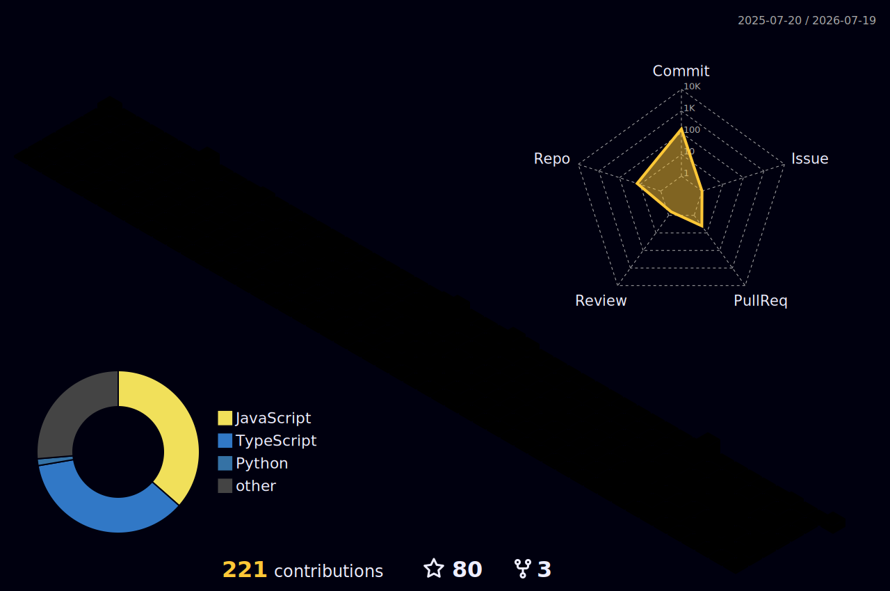

<!-- ████████████████████████████████████████████████████████████ -->
<!--                        HERO BANNER                           -->
<!-- ████████████████████████████████████████████████████████████ -->


<!-- TYPING INTRO -->
<p align="center">
  <a href="https://github.com/yuvrajnode">
    
  </a>
</p>

<!-- QUICK PITCH -->
<p align="center">
  <b>Software Development Engineer @ Innovativus</b> &nbsp;·&nbsp; B.Tech CSE @ VIT &nbsp;·&nbsp; GSoC Contributor &nbsp;·&nbsp; <b>Full-Stack · AI/ML · Web3 · DevOps</b>
</p>

<!-- BADGES -->
<p align="center">
  <a href="https://www.linkedin.com/in/yuvrajnode"></a>
  &nbsp;
  <a href="mailto:yuvrajsingh9027249999@gmail.com"></a>
  &nbsp;
  <a href="https://github.com/yuvrajnode"></a>
  &nbsp;
  <a href="https://www.instagram.com/yuvrajyx/"></a>
</p>

<p align="center">
  
  &nbsp;
  
</p>

<br/>

<!-- ████████████████████████████████████████████ IMPACT STRIP -->
<div align="center">

| 🎙️ Voice AI | 🤖 AI Agents | ⚡ Throughput | 🔗 On-Chain |
|:---:|:---:|:---:|:---:|
| **STT → LLM → TTS** | **80%+** task success | **300+** msg/sec | **99.99%** tx |
| cloning + Twilio calls | autonomous coding agent | real-time exchange | Solana DApp |

</div>

<br/>

<!-- ████████████████████████████████████████████ ABOUT -->


<table border="0" cellpadding="18" width="100%">
<tr>
<td width="55%" valign="top">

### 👋 About Me

**Software Development Engineer** at Innovativus Technologies — **promoted from intern to full-time in 3 months**. I build across **four domains, going deep in each**: production web apps, **LLM-powered & voice AI systems**, on-chain programs, and cloud-native infrastructure.

Right now I'm building a **production Voice AI platform**: real-time two-way voice conversations with AI assistants, **zero-shot voice cloning** (F5-TTS + Supertonic), a **Twilio phone assistant**, and a **RAG knowledge base** — so users talk to their own data in any voice they choose.

```text
🔭  Currently    →  SDE @ Innovativus · Voice AI platform
🎙️  Shipping     →  voice cloning · Twilio assistant · RAG
🌱  Learning     →  LLM internals · agentic systems
🤝  Open source  →  GSoC · p5.js · n8n
💬  Ask me about →  LLMs · TTS · Next.js · Solana · K8s
📫  Reach me     →  yuvrajsingh9027249999@gmail.com
⚡  Fun fact     →  I clone voices & fine-tune LLMs for fun
```

</td>
<td width="45%" valign="middle" align="center">



<p><sub>⬆ my head, visualized — an LLM core with a voice waveform</sub></p>

</td>
</tr>
</table>

<br/>

<!-- ████████████████████████████████████████████ SKILLS -->


<h2 align="center">🛠️ Tech Arsenal</h2>
<br/>

<!-- LANGUAGES -->
<p align="center">
  <b>💻 Languages</b>
  <br/><br/>
  
</p>

<br/>

<!-- AI / ML — the headline act -->
<p align="center">
  <b>🤖 AI / ML · LLMs · Voice</b>
  <br/><br/>
  
  &nbsp;
  
  
  
  <br/>
  
  
  
  <br/>
  
  
  
</p>

<br/>

<table align="center" width="100%">
<tr>
<td align="center" width="50%">

**🎨 Frontend**
<br/>


</td>
<td align="center" width="50%">

**⚙️ Backend & Databases**
<br/>


</td>
</tr>
<tr>
<td align="center">

**☁️ DevOps & Cloud**
<br/>


</td>
<td align="center">

**⛓️ Web3 & Tooling**
<br/>


</td>
</tr>
</table>

<br/>

<!-- ████████████████████████████████████████████ CURRENT BUILD -->


<h2 align="center">🎙️ Now Building — Voice AI Platform</h2>

<p align="center"><i>Production voice AI @ Innovativus — talk to AI assistants grounded in your own knowledge base, in any voice you choose.</i></p>

<div align="center">

| Capability | How it works |
|:---|:---|
| 🗣️ **Real-time voice conversations** | Two-way voice chat with AI assistants over a live STT → LLM → TTS loop |
| 🧬 **Zero-shot voice cloning** | F5-TTS + Supertonic neural TTS — natural cloned speech from seconds of reference audio |
| ☎️ **Twilio phone assistant** | Automated inbound/outbound calls with configurable voice personas |
| 📚 **RAG knowledge base** | Conversations grounded in the user's own documents & data |

</div>

<br/>

<!-- ████████████████████████████████████████████ PROJECTS -->


<h2 align="center">🚀 Selected Work</h2>
<br/>

<!--
  ⚠️ Create repos `ai-coding-agent` and `llm-finetuning`, then uncomment these pin cards:
<p align="center">
  <a href="https://github.com/yuvrajnode/ai-coding-agent">
    
  </a>
  <a href="https://github.com/yuvrajnode/llm-finetuning">
    
  </a>
</p>
-->

<p align="center">
  <a href="https://github.com/yuvrajnode/exchange">
    
  </a>
  <a href="https://github.com/yuvrajnode/doodle-space">
    
  </a>
</p>
<p align="center">
  <a href="https://github.com/yuvrajnode/Solana-Dapp">
    
  </a>
  <a href="https://github.com/yuvrajnode/Contest-tracker">
    
  </a>
</p>

<div align="center">

| Project | Domain | Impact | Stack |
|:---|:---:|:---:|:---|
| **🤖 [Autonomous AI Coding Agent](https://github.com/yuvrajnode)** | AI/ML | `80%+ task success` · `−40% hallucinations` | Python · LangGraph · RAG · pgvector |
| **🧠 [LLM Fine-Tuning Pipeline](https://github.com/yuvrajnode)** | AI/ML | `+25% accuracy` · `15+ checkpoints` | PyTorch · Hugging Face · LoRA · RLHF |
| **⚡ [Real-Time Crypto Exchange](https://github.com/yuvrajnode/exchange)** | Full-Stack | `300+ msg/sec` · `1,000+ clients` | Next.js · WebSockets · Redis · Postgres |
| **🎨 [Doodle Space](https://github.com/yuvrajnode/doodle-space)** | Full-Stack | `500+ concurrent` · `<100ms sync` | Turborepo · WebSockets · Prisma |
| **🔗 [Solana DApp & Launchpad](https://github.com/yuvrajnode/Solana-Dapp)** | Web3 | `99.99% tx success` | React · Web3.js · SPL · Anchor |
| **🏆 [Contest Tracker](https://github.com/yuvrajnode/Contest-tracker)** | Full-Stack | `CF · CC · LeetCode` | Next.js · shadcn/ui · TypeScript |

</div>

<br/>

<!-- ████████████████████████████████████████████ OPEN SOURCE & ACHIEVEMENTS -->


<h2 align="center">🌐 Open Source & Achievements</h2>
<br/>

<p align="center">
  
  &nbsp;
  
  &nbsp;
  
</p>

<div align="center">

| 🏅 | Highlight |
|:---:|:---|
| 🔀 | Merged PRs into **p5.js / Processing** & **n8n** across 2 open-source orgs as a **GSoC contributor** |
| 🤖 | Shipped **4 production-grade AI projects** (agents, RAG, fine-tuning, evals) in a 20+ module AI/ML program |
| 🧱 | Built **10+ full-stack apps** in the **100xDevs Full-Stack, DevOps & Blockchain Cohort** |
| 🇮🇳 | Proposed a citizen grievance platform at **Smart India Hackathon 2025** (national level) |

</div>

<br/>

<!-- ████████████████████████████████████████████ STATS -->


<h2 align="center">📊 GitHub Stats</h2>
<br/>

<p align="center">
  
  &nbsp;
  
</p>

<p align="center">
  
</p>

<!-- If any stats card ever shows a broken "?" image: the shared github-readme-stats.vercel.app
     instance is rate-limited at peak times. Permanent fix (5 min): deploy your own free instance —
     https://github.com/anuraghazra/github-readme-stats#deploy-on-your-own — then swap the domain
     in these URLs. -->

<p align="center">
  
</p>

<p align="center">
  
</p>

<br/>

<!-- ████████████████████████████████████████████ SNAKE -->


<h2 align="center">🏙️ 3D Contribution City</h2>

<p align="center"><sub>my year of commits, rendered as an isometric 3D city — regenerated daily by GitHub Actions</sub></p>

<p align="center">
  
</p>

<br/>


<h2 align="center">🐍 Contribution Graph</h2>
<br/>

<p align="center">
  <picture>
    <source media="(prefers-color-scheme: dark)" srcset="https://raw.githubusercontent.com/yuvrajnode/yuvrajnode/output/github-contribution-grid-snake-dark.svg" />
    <source media="(prefers-color-scheme: light)" srcset="https://raw.githubusercontent.com/yuvrajnode/yuvrajnode/output/github-contribution-grid-snake.svg" />
    
  </picture>
</p>

<br/>

<!-- ████████████████████████████████████████████ FOOTER -->
<p align="center"><i>"Give AI a voice, give the web real-time speed — and make it all run at scale."</i></p>


