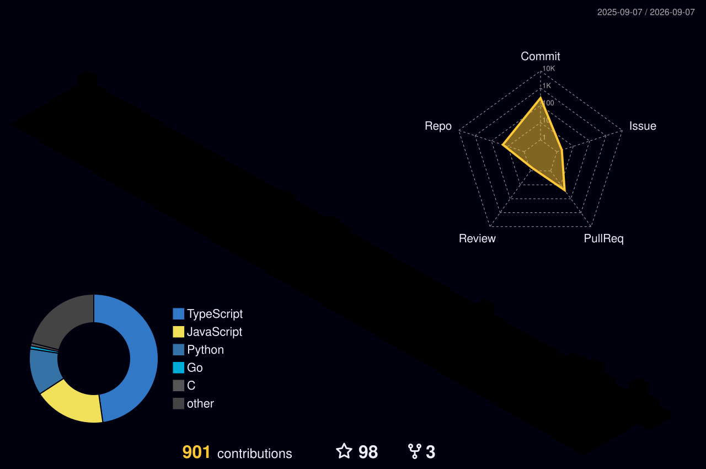

<!-- ─────────────────────────────  HEADER  ───────────────────────────── -->

  

  SDE at Innovativus &nbsp;·&nbsp; B.Tech CSE, VIT &nbsp;·&nbsp; Uttarakhand, India

  
  &nbsp;
  
  &nbsp;
  
  &nbsp;
  
  &nbsp;
  

 

<!-- ─────────────────────────────  OPEN SOURCE  ───────────────────────────── -->

<h2 align="center">Open Source</h2>

  Six projects, about 470k stars between them. Three of my patches are in main. 
  Mostly small correctness fixes in code I hit while building something else.

 

<table align="center" width="100%">
<tr>
<th align="left" width="26%">Project</th>
<th align="center" width="12%">Stars</th>
<th align="left" width="62%">Pull requests</th>
</tr>

<tr>
<td valign="top">

**[huggingface/&#8203;transformers](https://github.com/huggingface/transformers)**
 Python · the model library

</td>
<td align="center" valign="top">

</td>
<td valign="top">

&nbsp; [**#47509**](https://github.com/huggingface/transformers/pull/47509) Phi-4 Multimodal vision embedding init
 
&nbsp;&nbsp;&nbsp; [**#47558**](https://github.com/huggingface/transformers/pull/47558) Pix2Struct attention sized from `d_kv`

</td>
</tr>

<tr>
<td valign="top">

**[safedep/vet](https://github.com/safedep/vet)**
 Go · supply-chain scanner

</td>
<td align="center" valign="top">

</td>
<td valign="top">

&nbsp; [**#757**](https://github.com/safedep/vet/pull/757) Propagate GitHub org scan errors
 
&nbsp; [**#760**](https://github.com/safedep/vet/pull/760) Match npm registry by hostname, not full URL

</td>
</tr>

<tr>
<td valign="top">

**[fishaudio/&#8203;fish-speech](https://github.com/fishaudio/fish-speech)**
 Python · TTS and voice cloning

</td>
<td align="center" valign="top">

</td>
<td valign="top">

&nbsp;&nbsp;&nbsp; [**#1317**](https://github.com/fishaudio/fish-speech/pull/1317) Honour the `recursive` flag in `list_files()`
 
&nbsp;&nbsp;&nbsp; [**#1318**](https://github.com/fishaudio/fish-speech/pull/1318) Dispatch on type, not tuple length
 
&nbsp;&nbsp;&nbsp; [**#1319**](https://github.com/fishaudio/fish-speech/pull/1319) Validate reference args up front

</td>
</tr>

<tr>
<td valign="top">

**[calcom/cal.diy](https://github.com/calcom/cal.diy)**
 TypeScript · scheduling

</td>
<td align="center" valign="top">

</td>
<td valign="top">

&nbsp;&nbsp;&nbsp; [**#29954**](https://github.com/calcom/cal.diy/pull/29954) Sort duration badges numerically

</td>
</tr>

<tr>
<td valign="top">

**[n8n-io/n8n](https://github.com/n8n-io/n8n)**
 TypeScript · workflow automation

</td>
<td align="center" valign="top">

</td>
<td valign="top">

&nbsp; [**#20393**](https://github.com/n8n-io/n8n/pull/20393) Timezone-aware date formatting across the frontend

</td>
</tr>

<tr>
<td valign="top">

**[processing/p5.js](https://github.com/processing/p5.js)**
 JavaScript · creative coding

</td>
<td align="center" valign="top">

</td>
<td valign="top">

&nbsp; [**#9027**](https://github.com/processing/p5.js/pull/9027) Clarify `p5.Vector` is always 3-component

</td>
</tr>
</table>

  
    <a href="https://github.com/search?q=is%3Apr+author%3Ayuvrajnode&type=pullrequests&s=updated&o=desc">All pull requests</a>
    &nbsp;·&nbsp;
    <a href="https://github.com/search?q=is%3Apr+author%3Ayuvrajnode+is%3Amerged&type=pullrequests">Merged only</a>
  

 

<!-- ─────────────────────────────  STACK  ───────────────────────────── -->

<h2 align="center">Stack</h2>
 

  

 

  <b>AI, LLMs and voice</b>
    
  
  &nbsp;
  
  
  
  
   
  
  
  
  

 

<table align="center" width="100%">
<tr>
<td align="center" width="50%">

**Frontend**
 

</td>
<td align="center" width="50%">

**Backend and data**
 

</td>
</tr>
<tr>
<td align="center">

**Infra**
 

</td>
<td align="center">

**Chain and tools**
 

</td>
</tr>
</table>

 

<!-- ─────────────────────────────  ACTIVITY  ───────────────────────────── -->

<h2 align="center">Activity</h2>
 

  

  

  

 

