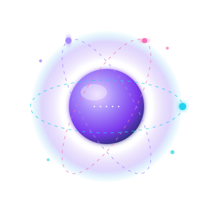

<!-- ████████████████████████████████████████████████████████████ -->
<!--                        HERO BANNER                           -->
<!-- ████████████████████████████████████████████████████████████ -->


<!-- TYPING INTRO -->
<p align="center">
  <a href="https://github.com/yuvrajnode">
    
  </a>
</p>

<!-- QUICK PITCH -->
<p align="center">
  <b>Software Development Engineer @ Innovativus</b> &nbsp;·&nbsp; B.Tech CSE @ VIT &nbsp;·&nbsp; <b>Full-Stack · AI/ML · Web3 · DevOps</b>
</p>

<!-- BADGES -->
<p align="center">
  <a href="https://www.linkedin.com/in/yuvrajnode"></a>
  &nbsp;
  <a href="mailto:yuvrajsingh9027249999@gmail.com"></a>
  &nbsp;
  <a href="https://github.com/yuvrajnode"></a>
  &nbsp;
  <a href="https://www.instagram.com/yuvrajyx/"></a>
</p>

<p align="center">
  
  &nbsp;
  
</p>

<br/>


<!-- ████████████████████████████████████████████ ABOUT -->


<table border="0" cellpadding="18" width="100%">
<tr>
<td width="55%" valign="top">

### 👋 About Me :)

**Software Development Engineer**. I build across **four domains, going deep in each**: production web apps, **LLM-powered & voice AI systems**, on-chain programs, and cloud-native infrastructure.

Right now I'm building a **production Voice AI platform**: real-time two-way voice conversations with AI assistants, **zero-shot voice cloning** (F5-TTS + Supertonic), a **Twilio phone assistant**, and a **RAG knowledge base** — so users talk to their own data in any voice they choose.

```text
  Currently    →  SDE @ Innovativus · Voice AI platform
  Shipping     →  voice cloning · Twilio assistant · RAG
  Learning     →  LLM internals · agentic systems
  Open source  →  Huggingface/Transformer · n8n
  Ask me about →  LLMs · TTS · Next.js · Solana · K8s
  Reach me     →  yuvrajsingh9027249999@gmail.com
```

</td>
<td width="45%" valign="middle" align="center">



<p><sub>My head, visualized an LLM core with a voice waveform</sub></p>

</td>
</tr>
</table>

<br/>

<!-- ████████████████████████████████████████████ SKILLS -->


<h2 align="center">Tech Arsenal</h2>
<br/>

<!-- LANGUAGES -->
<p align="center">
  <b>Languages</b>
  <br/><br/>
  
</p>

<br/>

<!-- AI / ML — the headline act -->
<p align="center">
  <b>AI / ML · LLMs · Voice</b>
  <br/><br/>
  
  &nbsp;
  
  
  
  <br/>
  
  
  
  <br/>
  
  
  
</p>

<br/>

<table align="center" width="100%">
<tr>
<td align="center" width="50%">

**Frontend**
<br/>


</td>
<td align="center" width="50%">

**Backend & Databases**
<br/>


</td>
</tr>
<tr>
<td align="center">

**DevOps & Cloud**
<br/>


</td>
<td align="center">

**Web3 & Tooling**
<br/>


</td>
</tr>
</table>

<br/>


<!-- ████████████████████████████████████████████ OPEN SOURCE & ACHIEVEMENTS -->


<h2 align="center">Open Source</h2>
<br/>

<p align="center">
  
  &nbsp;
  
  &nbsp;
</p>

<div align="center">
</div>

<br/>

<!-- ████████████████████████████████████████████ STATS -->


<h2 align="center">GitHub Stats</h2>
<br/>

<p align="center">
  
  &nbsp;
</p>

<p align="center">
  
</p>
<br/>

<!-- ████████████████████████████████████████████ SNAKE -->


<h2 align="center">Contribution City</h2>

<p align="center">
  
</p>

<br/>


