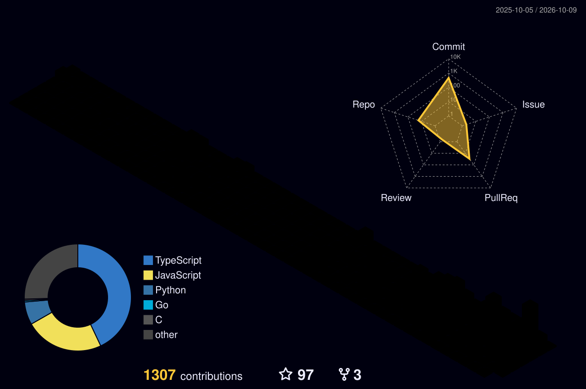

  <strong>Software Engineer · Full-stack &amp; AI/ML</strong> 
  SDE at Innovativus · B.Tech CSE, VIT · Uttarakhand, India

  <a href="https://www.linkedin.com/in/yuvrajnode">LinkedIn</a> &nbsp; / &nbsp;
  <a href="mailto:yuvrajsingh9027249999@gmail.com">Email</a> &nbsp; / &nbsp;
  <a href="https://github.com/yuvrajnode/resume">Recruiter overview</a> &nbsp; / &nbsp;
  <a href="#selected-projects">Selected projects</a> &nbsp; / &nbsp;
  <a href="#open-source">Open source</a>

I build LLM agents, retrieval systems and real-time web applications. My work spans Python and TypeScript backends, React interfaces, model evaluation, and Solana/Ethereum integrations. At work, my focus includes voice AI, speech synthesis and conversational assistants.

**Open source:** merged fixes in [Hugging Face Transformers](https://github.com/huggingface/transformers/pulls?q=is%3Apr+author%3Ayuvrajnode+is%3Amerged), [Supabase](https://github.com/supabase/supabase/pull/51385), [Fish Speech](https://github.com/fishaudio/fish-speech/pulls?q=is%3Apr+author%3Ayuvrajnode+is%3Amerged) and [SafeDep vet](https://github.com/safedep/vet/pulls?q=is%3Apr+author%3Ayuvrajnode+is%3Amerged). [Details below](#open-source).

## Selected projects

A starting point for reviewing my engineering work: what each project does, the decisions behind it, and the code to explore.

<table>
<tr>
<td width="50%" valign="top">

### [ACA · Autonomous Coding Agent](https://github.com/yuvrajnode/Autonomous-AI-Coding-Agent)

A plan–act–observe agent with tool execution, persistent memory, retrieval and a streaming run dashboard.

**Engineering:** tool boundaries, execution traces and an evaluation harness.

`Python` `LangGraph` `FastAPI` `PostgreSQL / pgvector`

[Architecture](https://github.com/yuvrajnode/Autonomous-AI-Coding-Agent/blob/main/docs/architecture.md) · [Evaluation design](https://github.com/yuvrajnode/Autonomous-AI-Coding-Agent/blob/main/docs/evals.md)

</td>
<td width="50%" valign="top">

### [LLM Fine-Tuning & Evaluation](https://github.com/yuvrajnode/LLM-Fine-Tuning-Evaluation-Pipeline)

LoRA supervised fine-tuning, DPO/IPO preference optimization and a repeatable checkpoint-comparison workflow.

**Engineering:** consistent evaluation prompts, checkpoint discovery, cached results and a report dashboard.

`PyTorch` `Transformers` `PEFT` `TRL`

[Pipeline & setup](https://github.com/yuvrajnode/LLM-Fine-Tuning-Evaluation-Pipeline#readme) · [Dashboard design](https://github.com/yuvrajnode/LLM-Fine-Tuning-Evaluation-Pipeline/blob/main/docs/dashboard.md)

</td>
</tr>
<tr>
<td valign="top">

### [Nexus · Market-Data Terminal](https://github.com/yuvrajnode/exchange)

Live order books, candlestick charts and trade streams in a responsive trading interface. Order entry is simulated.

**Engineering:** multiplexed WebSocket subscriptions, REST snapshots and incremental depth updates.

`Next.js` `React` `TypeScript` `WebSockets`

[Live demo](https://exchange-ruby-iota.vercel.app) · [Code & screenshots](https://github.com/yuvrajnode/exchange#readme)

</td>
<td valign="top">

### [Doodle Space · Collaborative Canvas](https://github.com/yuvrajnode/doodle-space)

A room-based whiteboard with drawing tools, an infinite canvas and multi-user synchronization.

**Engineering:** canvas interaction, shared room state and a monorepo spanning client, HTTP and WebSocket services.

`Next.js` `Turborepo` `WebSockets` `Prisma`

[Code & walkthrough](https://github.com/yuvrajnode/doodle-space#readme)

</td>
</tr>
<tr>
<td valign="top">

### [Connect Four · Multiplayer Game](https://github.com/yuvrajnode/Connect-Four-Game)

Real-time matches with automatic matchmaking, bot fallback and reconnect handling.

**Engineering:** server-managed turns, game-state transitions and an in-memory leaderboard.

`React` `Node.js` `WebSockets`

[Frontend demo](https://connect-four-game-sable.vercel.app) · [Code & setup](https://github.com/yuvrajnode/Connect-Four-Game#readme)

</td>
<td valign="top">

### [Multi-Chain Browser Wallet](https://github.com/yuvrajnode/web-based-wallet)

A browser wallet demo that derives Ethereum and Solana accounts from a BIP39 seed phrase.

**Engineering:** HD address derivation and integrations with two blockchain ecosystems.

`React` `ethers.js` `Solana Web3.js` `BIP39 / BIP44`

[Live demo](https://web-based-wallet-two-sable.vercel.app) · [Code & setup](https://github.com/yuvrajnode/web-based-wallet#readme)

</td>
</tr>
</table>

## Skills in practice

| Area | Tools and experience | Public example |
| --- | --- | --- |
| AI engineering | Python, LangGraph, tool use, RAG, pgvector, tracing and evaluations | [ACA](https://github.com/yuvrajnode/Autonomous-AI-Coding-Agent) |
| Model training | PyTorch, Hugging Face Transformers, LoRA/PEFT, DPO/IPO, checkpoint evaluation | [Fine-tuning pipeline](https://github.com/yuvrajnode/LLM-Fine-Tuning-Evaluation-Pipeline) |
| Frontend & real-time systems | TypeScript, React, Next.js, Tailwind CSS, WebSockets, Canvas API | [Nexus](https://github.com/yuvrajnode/exchange) · [Doodle Space](https://github.com/yuvrajnode/doodle-space) |
| Backend & data | Node.js, Express, FastAPI, PostgreSQL, Prisma, MongoDB, JWT, Zod | [CourseHub](https://github.com/yuvrajnode/CourseHub) · [Course API](https://github.com/yuvrajnode/course-selling-backend) |
| Web3 | Solana, Ethereum, wallet adapters, Token-2022, wagmi, viem, Jupiter | [Token Launchpad](https://github.com/yuvrajnode/Solana-Launchpad) · [Ethereum Wallet Connect](https://github.com/yuvrajnode/Ethereum-wallet-adapter-) |
| Delivery & quality | Docker, GitHub Actions, pytest, linting and typed configuration | [ACA](https://github.com/yuvrajnode/Autonomous-AI-Coding-Agent) · [Fine-tuning pipeline](https://github.com/yuvrajnode/LLM-Fine-Tuning-Evaluation-Pipeline) |
| Open source | Upstream bug fixes in Python, TypeScript, Go and C codebases | [Transformers](https://github.com/huggingface/transformers/pull/47558) · [Supabase](https://github.com/supabase/supabase/pull/51385) |

Additional work includes voice AI and speech pipelines, agent-memory systems, document Q&A, and native applications with SwiftUI and Kotlin/Jetpack Compose.

<strong>More projects · applications, Web3 and backend foundations</strong>

| Project | Focus |
| --- | --- |
| [Contest Tracker](https://github.com/yuvrajnode/Contest-tracker) | Contest APIs, countdowns, filters, bookmarks and solution links |
| [CourseHub](https://github.com/yuvrajnode/CourseHub) | Full-stack course catalog, user/admin authentication and purchase records |
| [Face Match](https://github.com/yuvrajnode/face-match-auth) | Camera capture and browser-based face comparison |
| [Solana Token Launchpad](https://github.com/yuvrajnode/Solana-Launchpad) | Token-2022 mint creation, metadata and initial supply on devnet |
| [Solana DApp](https://github.com/yuvrajnode/Solana-Dapp) | Wallet connections, balance checks, transfers and devnet airdrops |
| [Ethereum Wallet Connect](https://github.com/yuvrajnode/Ethereum-wallet-adapter-) | wagmi/viem wallet connections and account state |
| [Solana Swap](https://github.com/yuvrajnode/swap-contract) | Jupiter quotes, transaction signing and submission |
| [Course Marketplace API](https://github.com/yuvrajnode/course-selling-backend) | Express, MongoDB, JWT authentication and validation |
| [Todo API](https://github.com/yuvrajnode/todo-backend-with-database) | User-scoped CRUD, password hashing and input validation |
| [JWT Auth App](https://github.com/yuvrajnode/jwt-auth-app) | Authentication fundamentals with Express and a browser client |
| [CLI Todo](https://github.com/yuvrajnode/cli-todo-app) | Command-line interfaces with Commander and Chalk |
| [Express Calculator](https://github.com/yuvrajnode/express-calculator-api-basics) | HTTP routing and JSON API fundamentals |

<!-- ─────────────────────────────  OPEN SOURCE  ───────────────────────────── -->

<h2 align="center">Open Source</h2>

  Eight projects, about 600k stars between them. Eight of my patches are merged upstream, and five more are in review.
   
  Mostly small correctness fixes in code I hit while building something else.

 

<table align="center" width="100%">
<tr>
<th align="left" width="32%">Project</th>
<th align="left" width="68%">Pull requests</th>
</tr>

<tr>
<td valign="top">

&nbsp; **[huggingface/&#8203;transformers](https://github.com/huggingface/transformers)**
 Python · the model library

</td>
<td valign="top">

&nbsp; [**#47509**](https://github.com/huggingface/transformers/pull/47509) Phi-4 Multimodal vision embedding init
 
&nbsp; [**#47558**](https://github.com/huggingface/transformers/pull/47558) Pix2Struct attention sized from `d_kv`

</td>
</tr>

<tr>
<td valign="top">

&nbsp; **[supabase/&#8203;supabase](https://github.com/supabase/supabase)**
 TypeScript · Postgres platform · Studio

</td>
<td valign="top">

&nbsp; [**#51385**](https://github.com/supabase/supabase/pull/51385) Default cron HTTP timeout when `timeout_milliseconds` is omitted
 
&nbsp;&nbsp;&nbsp;&nbsp;&nbsp; [**#51384**](https://github.com/supabase/supabase/pull/51384) Keep wrapper option values that contain `=`
 
&nbsp;&nbsp;&nbsp;&nbsp;&nbsp; [**#51383**](https://github.com/supabase/supabase/pull/51383) Parse quoted column names in foreign key constraints

</td>
</tr>

<tr>
<td valign="top">

&nbsp; **[fishaudio/&#8203;fish-speech](https://github.com/fishaudio/fish-speech)**
 Python · TTS and voice cloning

</td>
<td valign="top">

&nbsp; [**#1317**](https://github.com/fishaudio/fish-speech/pull/1317) Honour the `recursive` flag in `list_files()`
 
&nbsp; [**#1318**](https://github.com/fishaudio/fish-speech/pull/1318) Dispatch on type, not tuple length
 
&nbsp; [**#1319**](https://github.com/fishaudio/fish-speech/pull/1319) Validate reference args up front

</td>
</tr>

<tr>
<td valign="top">

&nbsp; **[safedep/vet](https://github.com/safedep/vet)**
 Go · supply-chain scanner

</td>
<td valign="top">

&nbsp; [**#757**](https://github.com/safedep/vet/pull/757) Propagate GitHub org scan errors
 
&nbsp; [**#760**](https://github.com/safedep/vet/pull/760) Match npm registry by hostname, not full URL
 
&nbsp;&nbsp;&nbsp; [**#761**](https://github.com/safedep/vet/pull/761) Surface malicious package lookups that never completed

</td>
</tr>

<tr>
<td valign="top">

&nbsp; **[n8n-io/n8n](https://github.com/n8n-io/n8n)**
 TypeScript · workflow automation

</td>
<td valign="top">

&nbsp;&nbsp;&nbsp;&nbsp;&nbsp; [**#40531**](https://github.com/n8n-io/n8n/pull/40531) AI Agent node: replay tool-call arguments with Anthropic thinking blocks
 
&nbsp;&nbsp;&nbsp;&nbsp;&nbsp; [**#40507**](https://github.com/n8n-io/n8n/pull/40507) Editor: skip the provisioning config request when it is unavailable
 
&nbsp;&nbsp;&nbsp;&nbsp;&nbsp; [**#40501**](https://github.com/n8n-io/n8n/pull/40501) Editor: keep all matching actions in node search
 
&nbsp;&nbsp;&nbsp; [**#20393**](https://github.com/n8n-io/n8n/pull/20393) Timezone-aware date formatting across the frontend

</td>
</tr>

<tr>
<td valign="top">

&nbsp; **[calcom/cal.diy](https://github.com/calcom/cal.diy)**
 TypeScript · scheduling

</td>
<td valign="top">

&nbsp;&nbsp;&nbsp; [**#29954**](https://github.com/calcom/cal.diy/pull/29954) Sort duration badges numerically

</td>
</tr>

<tr>
<td valign="top">

&nbsp; **[freebsd/&#8203;freebsd-src](https://github.com/freebsd/freebsd-src)**
 C · FreeBSD source tree

</td>
<td valign="top">

&nbsp;&nbsp;&nbsp; [**#2384**](https://github.com/freebsd/freebsd-src/pull/2384) libusb: Validate arguments before dereferencing the hotplug context
 
&nbsp;&nbsp;&nbsp; [**#2383**](https://github.com/freebsd/freebsd-src/pull/2383) libusb: Fix NULL dereference when a hotplug callback deregisters itself

</td>
</tr>

<tr>
<td valign="top">

&nbsp; **[processing/p5.js](https://github.com/processing/p5.js)**
 JavaScript · creative coding

</td>
<td valign="top">

&nbsp;&nbsp;&nbsp; [**#9027**](https://github.com/processing/p5.js/pull/9027) Clarify `p5.Vector` is always 3-component

</td>
</tr>

</table>

  
    <a href="https://github.com/search?q=is%3Apr+author%3Ayuvrajnode&type=pullrequests&s=updated&o=desc">All pull requests</a>
    &nbsp;·&nbsp;
    <a href="https://github.com/search?q=is%3Apr+author%3Ayuvrajnode+is%3Amerged&type=pullrequests">Merged only</a>
  

 

## Activity

---

**Let’s talk engineering:** [LinkedIn](https://www.linkedin.com/in/yuvrajnode) · [Email](mailto:yuvrajsingh9027249999@gmail.com)
